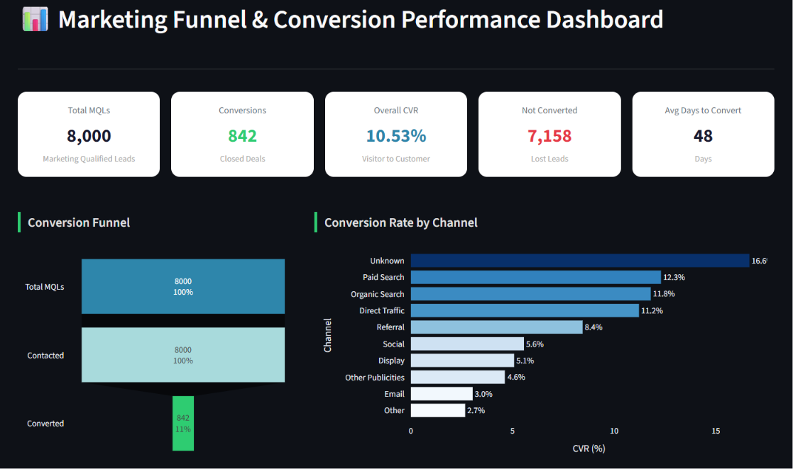

# 📊 FUTURE_DS_03
## Marketing Funnel & Conversion Performance Analysis

---

## 🚀 Future Interns — Data Science & Analytics Internship
**Task 3 | Track Code: DS | Repository: FUTURE_DS_03**

This project analyzes real-world marketing funnel data from the **Olist e-commerce platform** to identify conversion drop-offs, channel performance, lead behavior trends, and provide actionable business recommendations.

---

## 🎯 Project Objectives

- Analyze MQL (Marketing Qualified Lead) data and closed deals
- Identify key funnel drop-off points
- Measure conversion rates across acquisition channels
- Understand lead behavior, business segments, and type performance
- Build an interactive Streamlit dashboard for business reporting
- Generate data-driven recommendations

---

## 📂 Repository Structure

```
FUTURE_DS_03/
├── dashboard/
│   ├── app.py
│   └── dashboard.png
├── dataset/
│   ├── olist_marketing_qualified_leads_dataset.csv
│   └── olist_closed_deals_dataset.csv
├── notebook/
│   └── Analysis.ipynb
├── report/
│   └── Task_Report.pdf
└── insights/
    └── key_insights.md
├── README.md
└── requirements.txt

```

---

## 📊 Dashboard Preview

### 🌙 Interactive Dashboard
<p align="center">
  
</p>

---

## 📁 Dataset Information

| Detail | Info |
|--------|------|
| **Source** | [Olist Marketing Funnel — Kaggle](https://www.kaggle.com/datasets/olistbr/marketing-funnel-olist) |
| **Files** | `olist_marketing_qualified_leads_dataset.csv` + `olist_closed_deals_dataset.csv` |
| **MQL Records** | 8,000 |
| **Closed Deals** | 842 |
| **Period** | June 2017 – June 2018 |

### Key Columns After Merging:

| Column | Description |
|--------|-------------|
| `mql_id` | Unique Lead Identifier |
| `first_contact_date` | Date lead first contacted |
| `origin` | Acquisition channel |
| `won_date` | Date deal was closed |
| `business_segment` | Type of business (Home Decor, etc.) |
| `lead_type` | Online Big / Medium / Small, Offline |
| `business_type` | Reseller / Manufacturer |
| `declared_monthly_revenue` | Seller's declared revenue |
| `converted` | 1 = Converted, 0 = Not Converted |
| `days_to_convert` | Days from first contact to conversion |

---

## 🛠️ Technologies Used

| Technology | Purpose |
|------------|---------|
| Python 3.10+ | Core Analysis |
| Pandas | Data Cleaning & Manipulation |
| NumPy | Numerical Operations |
| Matplotlib | Static Visualizations |
| Seaborn | Statistical Plots |
| Plotly | Interactive Charts |
| Streamlit | Dashboard Development |
| Jupyter Notebook | Development Environment |

---

## 🧹 Data Cleaning Process

- Merged two datasets on `mql_id` using a **left join** to retain all MQLs
- Parsed `first_contact_date` and `won_date` to datetime
- Filled missing `origin` values with `'unknown'`
- Created `converted` binary flag (1 = has `won_date`, 0 = null)
- Computed `days_to_convert` as difference between dates
- Standardized category labels (title case, underscore removal)

---

## 📈 Analysis Performed

### Univariate Analysis
- Lead distribution by acquisition channel
- Business segment frequency
- Lead type breakdown
- Business type distribution

### Bivariate Analysis
- Conversion rate by channel
- Lead type vs CVR
- Monthly CVR trend
- Business segment vs conversion count

### Advanced Analysis
- Full funnel: MQL → Contact → Conversion
- Days-to-convert distribution and median
- Quarterly lead and conversion volume
- Declared monthly revenue by segment

---

## 📌 KPI Summary

| KPI | Value |
|-----|-------|
| Total MQLs | 8,000 |
| Total Conversions | 842 |
| **Overall CVR** | **10.53%** |
| Lost Leads | 7,158 (89.47%) |
| Avg Days to Convert | ~47 days |
| Top Channel (CVR) | Referral / Direct |
| Top Business Segment | Home Decor (105) |
| Top Lead Type | Online Medium |

---

## 💡 Key Insights

1. **Critical drop-off** — 89.47% of MQLs never convert; the funnel loses the most leads at the very first stage
2. **Organic Search** brings the most leads (28.7%) but may not have the best quality per lead
3. **Referral & Direct Traffic** show highest intent and conversion rates
4. **Unknown origin (13.7% of leads)** — UTM tracking gap causing attribution blindspot
5. **Home Decor, Health & Beauty, Car Accessories** dominate among converted leads
6. **Online Medium lead type** yields the most conversions overall
7. **Resellers (70%)** dominate closed deals vs Manufacturers (29%)

---

## 🚀 Business Recommendations

| Priority | Action | Impact |
|----------|--------|--------|
| 🔴 High | Fix UTM tracking for unknown origins | Recover 13.7% of invisible attribution |
| 🔴 High | Build email nurture sequence for organic leads | +2–4% CVR improvement |
| 🟡 Medium | Launch formal referral partner program | Scale highest-CVR channel |
| 🟡 Medium | Focus SDR team on Online Medium + Online Big | Higher close rates |
| 🟢 Low | Create manufacturer-specific onboarding | Diversify business type mix |
| 🟢 Low | Targeted campaigns for Home Decor & Health/Beauty | Proven high-conversion segments |

---

## ▶️ How to Run

### 1️⃣ Clone Repository
```bash
git clone https://github.com/yourusername/FUTURE_DS_03.git
cd FUTURE_DS_03
```

### 2️⃣ Install Dependencies
```bash
pip install -r requirements.txt
```

### 3️⃣ Run Jupyter Notebook
```bash
jupyter notebook notebook/Analysis.ipynb
```

### 4️⃣ Run Streamlit Dashboard
```bash
cd dashboard
streamlit run app.py
```

---

## 📚 Skills Gained

- Marketing Funnel Analysis
- Conversion Rate Optimization (CRO) Thinking
- Cohort & Segmentation Analysis
- Interactive Dashboard Development (Streamlit)
- EDA with Python (Pandas, Matplotlib, Seaborn, Plotly)
- Business Insight Generation
- Data Cleaning & Preprocessing

---

## 👨‍💻 Author

**Deepak**  
🎓 B.Tech in Artificial Intelligence  
🏫 Delhi Skill and Entrepreneurship University (DSEU)

---

## ⭐ Acknowledgement

This project was completed as part of the **Future Interns Data Science & Analytics Internship Program**.

Dataset: [Olist Marketing Funnel on Kaggle](https://www.kaggle.com/datasets/olistbr/marketing-funnel-olist)

>---
<div align="center"><i>⭐ Star this repo if you found it helpful!</i></div>
